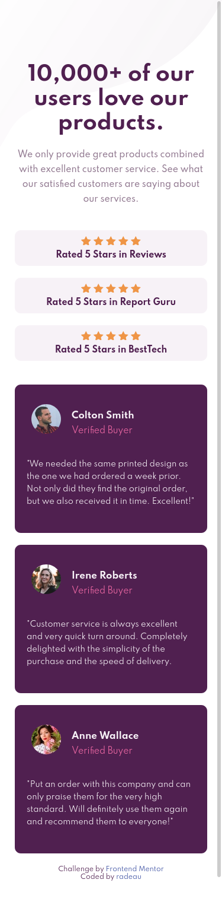
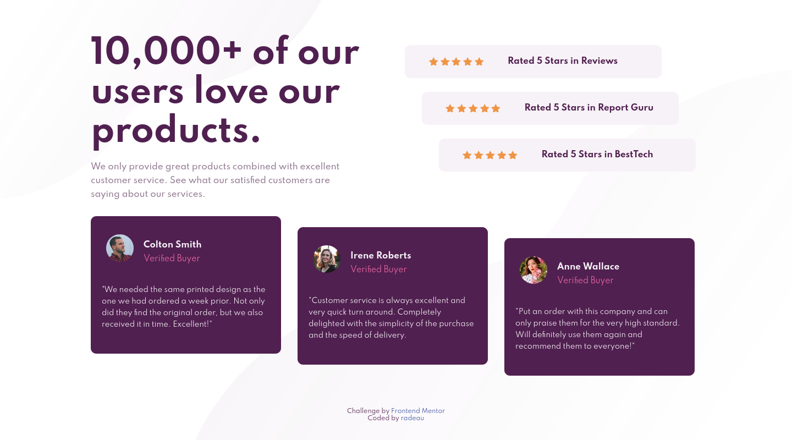

# Frontend Mentor - Social proof section solution 

This is a solution to the [Social proof section challenge on Frontend Mentor](https://www.frontendmentor.io/challenges/social-proof-section-6e0qTv_bA). Frontend Mentor challenges help you improve your coding skills by building realistic projects. 

## Table of contents

- [Overview](#overview)
  - [The challenge](#the-challenge)
  - [Screenshot](#screenshot)
  - [Links](#links)
- [My process](#my-process)
  - [Built with](#built-with)
  - [What I learned](#what-i-learned)
  - [Continued development](#continued-development)
  - [Useful resources](#useful-resources)
- [Author](#author)
- [Acknowledgments](#acknowledgments)

## Overview

### The challenge

Users should be able to:

- View the optimal layout for the section depending on their device's screen size

### Screenshot



 

### Links

- Solution URL: [https://github.com/radeau/frontend-mentor-challenges/tree/master/social-proof-section-master](https://github.com/radeau/frontend-mentor-challenges/tree/master/social-proof-section-master)
- Live Site URL: [https://radeau.github.io/frontend-mentor-challenges/social-proof-section-master/](https://radeau.github.io/frontend-mentor-challenges/social-proof-section-master/)

## My process

### Built with

- Semantic HTML5 markup
- CSS custom properties
- Flexbox
- CSS Grid
- Mobile-first workflow

### What I learned

On this challenge, I was able to apply grids and flex concept although I have yet to improve on how and when to use it. The background property is also a concept that takes me time to figure out how to apply but its simple as snippet below:

```css
body {
    background: url(./images/bg-pattern-top-desktop.svg), url(./images/bg-pattern-bottom-desktop.svg) bottom right;
    background-repeat: no-repeat;
}
```
### Continued development

I am currently taking the responsive layout course of Kevin Powell as I have to improve my knowledge on this concept. 

### Useful resources

- [Grids:Learn web development | MDN](https://developer.mozilla.org/en-US/docs/Learn/CSS/CSS_layout/Grids) - MDN really helped me a lot on Grid & Flex concept. I'd recommend it to anyone still learning this concept.

- [A Complete Guide to Grid](https://css-tricks.com/snippets/css/complete-guide-grid/) - This helped me for many reason. It's easy to understand with the visual aids and code snippets and I really liked the pattern and will use it going forward.

- [HTML and CSS Guide](https://frontendmasters.github.io/bootcamp/) - This is an amazing article which helped me understand syntax of HTML and CSS.  

## Author

- Website - [Kevin Rad Poquita](https://github.com/radeau)
- Frontend Mentor - [@radeau](https://www.frontendmentor.io/profile/radeau)
- Twitter - [@kvnRAD_](https://www.twitter.com/kvnRad_)

## Acknowledgments

Thank you Frontend Mentor! :raised_hands: :clap: